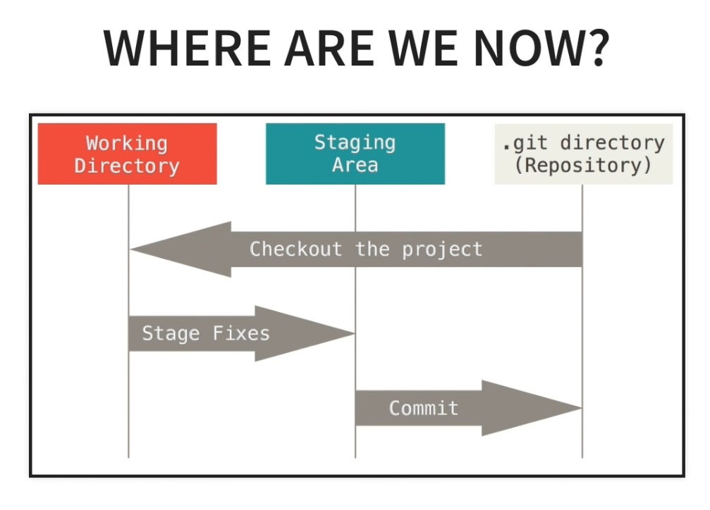

# GIT COMMAND LINE
## BASICS OF GIT
#### CONFIGURATION

Git email nad name should be set after install. This can be done by following commands.
```bash
git config --global user.name "Tarun Tehri"
git config --global user.email "tehritarun@gmail.com"
git config --list       #this show all git configuration values
```

#### INITIALIZING REPOSITORY
```bash
git init
git status      #to get status of changes
```



#### ADDING AND REMOVING FILES FROM STAGING AREA
To add files in staging area **add** command can be used as below.
```bash
git add -A              #adds all files in staging area
git add filename.txt    #adds single file in staging area
git add *.txt           #adds all txt files to staging area
```
To remove files in staging area **reset** command can be used as below.
```bash
git reset               #removes all files from staging area
git reset filename.txt  #removes single files from staging area
```

#### COMMITING CHANGES
To commit all the changes in staging area follwing command can be used.
```bash
git commit -m "commit message here"
git log                 #This used to see the commit history
```
Other examples of **commit** command are as below
```bash
git commit --amend -m "new commit message"  #this changes the message of last commit
git commit --amend                          #this saves new changes in last commit
```
#### CLONING REMOTE REPOSITORY
```bash
git clone {remote repo URL} {local path}
git remote -v   #to get info of connected remote repository
git branch -a   #to list all the branches in repository
```
#### PUSHING CHANGES TO REMOTE REPOSITORY
1. Make the changes
Follwing command can be used to list all the changes in modified files
```bash
git diff
```
2. Commit the changes made
```bash
git status
git add -A
git commit -m "Commit message"
```
3. Pull latest changes from remote branch **master** 
```bash
git pull origin master
```
4. Push commited changes to remote branch **master** 
```bash
git push origin master
```
#### GIT WORKFLOW
1. ##### Create a new branch
```bash
git branch newbranch
git checkout newbranch
```
2. ##### Commit and push the changes
a. Make Necessory modification in files
b. Commit the changes
c. Push changes to remote
```bash
git push -u origin newbranch
```
Multiple commit can be on this new branch with mentioned commands

3. ##### Merge Branch with master
After all the changes are made,commited and pushed on feature branch(newbranch). we need to merge the branch with master branch.
a. Switch to master branch and pull latest changes.
```bash
git checkout master
git pull origin master
```
b. Merge branch in master branch. and push to remote
```bash
git merge newbranch
git push origin master
```
4. ##### Delete the branch.
```bash
git branch --merged       #to get list of merged branch
git branch -d newbranch
git push origin --delete
git branch -a             #to get list of branches
```

## HANDLING MISTAKES
#### UNDO CHANGES TO LAST COMMIT

```bash
git checkout filenamt.txt
```
#### CHANGES IN LAST COMMIT
1. ##### Change message of last commit
```bash
git commit --amend -m "new commit message"
```
2. ##### Add changes to last commit
```bash
git status
git add -A
git commit --ammend
git log --stat        #to check logs with file changes information
```
}Note here that this command modifies the git history. Hence this should be used only when commit is not pushed to remote
#### MOVE COMMIT FROM ONE BRANCH TO ANOTHER
If by mistake you commit changes in master branch instead of feature branch and want to move commit from master to featur branch
1. ##### Get hash of commit and switch to new branch
```bash
git log
git branch newbranch
```
2. ##### Copy commit to new branch
```bash
git cherry-pick {hash}
```
3. ##### Remove commit from master branch
```bash
git checkout master
git log
git reset --soft {hash}
```
4. ##### Get rid of untracked files
```bash
git clean -df
```
#### GIT RESET TYPES

| Soft Reset    | Mixed Reset [Default]     | Hard Reset      |
|---------------- | --------------- | --------------- |
| Return to desired commit    | Return to desired commit    | Return to desired commit    |
| Changes moved to staging area    | Changes moved to working directory    | Changes of tracked filed gets deleted while untracked files moved to working dir    |

#### UNDO HARD RESET
First we need to use **reflog** command. **reflog** command shows all commits in oreder we refrence them. But this gets garbage collected in 30 days.
```bash
git reflog  #to get them commit hash
git checkout {hash}
```
After this step all changes are undid to comit with mentioned hash. Also, we automatically moved to dettached head state. That means we are not connected any branch.
```bash
git branch backup
```
This saves the current state to any branch. After this we can merge this branch to master branch or any other branch.
#### GIT REVERT
All the steps mentioned for reverting changes untill now, modifies the commit history. Hence they should only be perform is commits and changes are not pushed to remote.
To preserve the commit history and revert changes we use **revert** command as below.
```bash
git revert {hash of commit we want to undo}
git diff {hash_1} {hash_2}          #This shows difference between two commits
```
## GIT STASH
git shash command is used to temporary save uncommitted changes for later use.
```bash
git stash save "message"
```
There are 2 ways to get changes back from saved stash
1. stash ***apply***: this method applies mentioned stash and keeps that stash in list. we need to remove that manually if required.
```bash
git stash list      #to get list of saved stash
git stash apply {stash_name}
```
2. stash ***pop***: this method applies recent stash in list and drop it from stash list.
```bash
git stash pop
```
##### Remove Stash
To remove stash from list without applying its changes, we use stash **drop** command.
```bash
git stash list      #to get list of saved stash
git stash drop {stash_name}
```
To remove all stashes from list stash **clear** command can be used.
```bash
git stash clear
```
##### Copy changes from master to feature branch
```bash
git stash save "feature saved"  #save changes to stash
git stash list                  #get list of stashes
git checkout newbranch          #switch to new branch
git stash pop                   #apply the stash in new branch
git diff                        #check changes by diff command
```
in new branch these changes can be committed as desired
